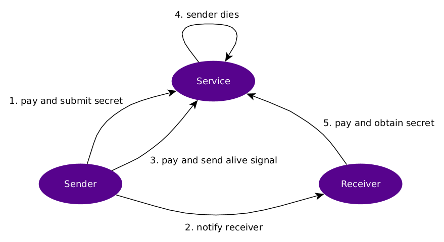

# Lightning-powered Dead Men's Button

This repository contains the code that was used during the workshop "Building a
Lightning-powered in-protocol dead man's button" at [Advancing Bitcoin
2020](http://www.advancingbitcoin.com/) in London. 

## Goal

The goal of setting up a Dead Men's Button is to release a secret when the owner
of the secret "dies" (shows no sign of life anymore). Dead Men's Buttons have
been used in real life, for example by whistleblowers to release a key to
decrypt leaked documents. Another use case is crypto estate planning where
beneficiaries get access to a wallet when the button is no longer pressed.

## Why Lightning?

If one doesn't want to set up their own server to act as a Dead Men's Button and
use a third party instead, it is necessary to incentivize the third party.
Lightning as a payment system can serve this goal. Other useful characteristics
of Lightning are that it allows the sender to remain private and the attachment
of custom data to a payment. For more information on custom data in Lightning,
check out these
[slides](https://twitter.com/joostjgr/status/1225565123131121665).

## Process

We define three actors: the `sender` who owns the secret, the `service` that
keeps the secret and the `receiver` who receives the secret if the `sender`
dies.

There are many ways in which Lightning (payments) can be a building block of a
Dead Men's Button. Below is a description of one possible way to do it, but it
is likely that there are better designs. This design also serves to
illustrate some of the aspects to take into account.



### Step 1: Submitting the secret
`sender` sends a [keysend](https://github.com/lightningnetwork/lnd/pull/3795)
payment to `service` and includes a 32-byte secret as a [custom
record](https://github.com/lightningnetwork/lnd/pull/3900). The secret could be
a decryption key or a [shamir
share](https://en.wikipedia.org/wiki/Shamir%27s_Secret_Sharing) of a decryption
key. With n-of-m secret sharing, multiple Dead Men's Buttons can be used to
increase reliability.

`service` stores the secret and an expiration date. Because of onion routing,
`service` doesn't know who the `sender` is. This protects the sender from becoming
an attack target.

### Step 2: Notify receiver
`sender` tells `receiver` that a Dead Men's Button is set up. `sender` also
gives `receiver` the sha256 hash of the secret and the node pubkey of `service`.
`sender` can notify `receiver` anonymously (possibly via another keysend
payment).

`sender` could optionally give `receiver` a list of pubkeys instead of just one,
to not reveal where exactly the secret is stored.

### Step 3: Send alive signal

`sender` periodically pays `service` to push forward the expiration date. The
hash of the secret is included in a custom record.

Another option is to include
a random `nonce` in the custom record and use `H(secret XOR nonce)` as the
payment hash. That way, `service` can only pull the payment if they still know
what the secret is. This is an indication for the `sender` that the service is
still working properly. `service` is incentived to hold on to the secret,
otherwise the periodic payments will stop. 

`sender` can also try to pay to the secret hash. If that payment succeeds (see
also step 5), `service` released too early and should be considered irreliable.
`service` is incentivized to not release too early, because it would stop the
stream of payments and damage the service's reputation.

### Step 4: Sender dies

`service` doesn't receive the alive signal in time. It then inserts an
invoice in its database with secret as the preimage. It is incentived to do
this, because the `service` receives money when someone pays the invoice.

### Step 5: Receiver obtains secret

Receiver tries to pay the `service` with the hash they got from `sender`. If
`sender` provided a list of pubkeys, `receiver` will try them all. An invoice
has been created with secret as the invoice, so the payment should succeed
somewhere. The secret will be revealed to the receiver. Because of onion
routing, `service` will at no point learn the identity of `receiver`, who could
otherwise become an attack target.

## Implementation

The code in this repo is extremely limited and does not implement everything
described above. Also the very basic requirement of persisting the secret to
disk isn't implemented. It only includes code to run the `service`. `sender` and
`receiver` need to use `lncli` for their actions.

## How to run

### Setup

* Set up three `lnd` instances for `sender`, `service` and `receiver`. For
  testing, the same node can be used for `sender` and `receiver`. Run the
  `service` node with `--accept-keysend`.


* Make sure there is a channel between `sender` and `service` and between
  `receiver` and `service`.


* Build the Dead Men's Button service: `go build`


* Start the service: `./deadmensbutton --network=regtest`. Adjust network if
  running on testnet or mainnet. For other configuration flags, use `--help`.
  Make sure it is connected to the `service` node. Expected output:

```
Lightning Dead Men's Button

Connected to: 03a34480f830d43653d97385e65ce0cbe0361f96a408b3c1b3f80dc8546f3c0892
```

### Running

#### Submit the secret (step 1)
We will use the secret `71b76acfbc436af95a909981277971ab479be94f5fc32984b50af676fe009dab` with hash `58dd3d6fedbbf3d73db576022d906411a6dc518b13c0d242e2c86f20a3f73e8b`.

Now send a keysend payment with a custom record (we use record id `80000` to send the secret):

`lncli sendpayment -d 03a34480f830d43653d97385e65ce0cbe0361f96a408b3c1b3f80dc8546f3c0892 -a 500 --keysend --data 80000=71b76acfbc436af95a909981277971ab479be94f5fc32984b50af676fe009dab`

Expected output from `service`:

`Received secret: hash=58dd3d6fedbbf3d73db576022d906411a6dc518b13c0d242e2c86f20a3f73e8b, expiry=2020-02-12 16:50:29.619479864 +0100 CET m=+12.138264061`

#### Send alive signal (step 3)

Repeat step 1 to extend the deadline.

#### Sender dies (step 4)

If step 3 isn't executed periodically (currently every 10 seconds), `service` will reveal the secret:

`Revealing secret: hash=58dd3d6fedbbf3d73db576022d906411a6dc518b13c0d242e2c86f20a3f73e8b`

#### Receiver obtains secret (step 5)

The service has inserted an invoice. If the receiver pays 1000 sats to the server, it will learn the secret:

`lncli sendpayment -d 03a34480f830d43653d97385e65ce0cbe0361f96a408b3c1b3f80dc8546f3c0892 -a 1000 -r 58dd3d6fedbbf3d73db576022d906411a6dc518b13c0d242e2c86f20a3f73e8b`

## Final notes

I hope that this description provides a glimpse into the whole new realm of possibilities that is opened up by the addition of keysend and custom record sending.
The Dead Men's Button is just an example and I am sure there are numerous other applications waiting to be invented. 

Let me know what you think and feel free to extend the code in this repository in whatever way.


